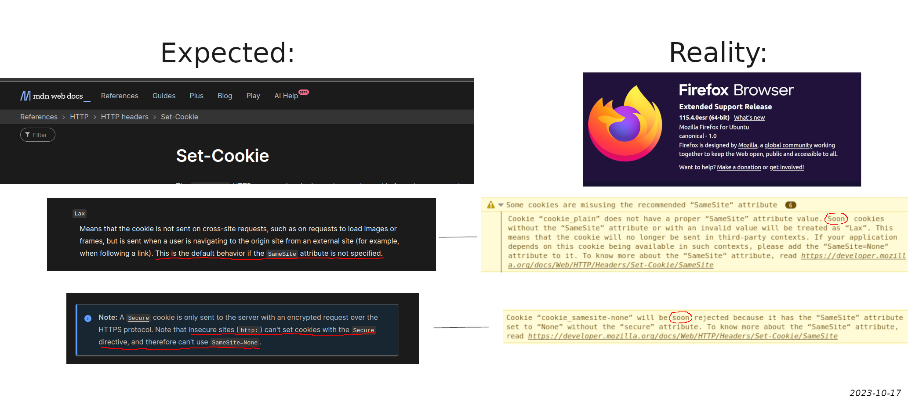

## Web Security 101
_2023-10, Eliot Roxbergh_

Some notes on web security. Headers, cookies, ..

## iframe: Firefox vs Chromium
It gets complicated as Firefox and Chromium acts differently regarding iframes as well as cookies.

Cookies can be set either via Javascript document.cookie, or the Set-Cookie HTTP header. In testing this did not make any difference.

### Chromium:
1. Defaults to SameSite=Lax
2. Does not allow Samesite=None and w/o Secure
3. Uses cookies from other tabs

i.e. in a cross-domain iframe: shows only the cookie:
- SameSite=None; Secure

**Brave** exhibited the same behavior during testing as Chromium (both are Chromium-based)

### Firefox
1. Defaults to SameSite=None and not Secure! (they say that they'll change to Lax "soon", see picture below)
2. Allows for SameSite=None and w/o Secure! (they say that they will change this "soon", see picture below)
3. Does not use cookies from other tabs (See "Partitioned" [1])

i.e. in a cross-domain iframe: shows the cookies:
- [no cookie attributes set]
- Secure
- SameSite=None;
- SameSite=None; Secure

=> Firefox defaults to _SameSite=None_ and NOT _Secure_, (cookies can be sent plaintext).\
Note this is exactly the opposite of what they say [2].



### Summary

Today's date 2023-10-17 \
Chromium: 118.0.5993.70 (Official Build) snap (64-bit) \
Brave: 1.59.117 Chromium: 118.0.5993.70 (Official Build) (64-bit) \
Firefox: 115.3.1esr 64-bit

Q: How about Safari browser? (let's assume all Chromium-based browsers behave the same)

[1] - <https://developer.mozilla.org/en-US/docs/Web/Privacy/Storage_Access_Policy/Errors/CookiePartitionedForeign> \
[2] - _SameSite=None_ should not be allowed without _Secure_, and _SameSite=Lax_ should be the default, according to <https://developer.mozilla.org/en-US/docs/Web/HTTP/Headers/Set-Cookie#secure>

#### Example used in testing

Apache2 and use (e.g.) self-signed TLS. \
Example cross-domain iframe: <https://developer.mozilla.org/en-US/docs/Web/HTML/Element/iframe>

**var/www/html/index.html**
```html
<!DOCTYPE html>
<html>
<head>
</head>
<body>
    <h1>Set and Display Cookies Example</h1>

    <button id="setCookieButton">Set Cookie</button>
    <button id="displayCookiesButton">Display Cookies</button>

    <p id="cookieStatus"></p>
    <p id="cookieList"></p>

    <script>
        // Function to set a cookie
        function setCookie() {
            // Set the cookie name and value
            document.cookie = "cookie_plain=0000";
            document.cookie = "cookie_httponly=1111;HttpOnly;";
            document.cookie = "cookie_secure=2222;secure;";
            document.cookie = "cookie_samesite-strict=3333;SameSite=Strict;";
            document.cookie = "cookie_samesite-lax=4444;SameSite=Lax;";
            document.cookie = "cookie_samesite-none=5555;SameSite=None;";
            document.cookie = "cookie_samesite-none-secure=6666;SameSite=None;Secure;";

            // Update the status message
            document.getElementById("cookieStatus").textContent = "Cookie has been set.";
        }

        // Function to retrieve and display all cookies
        function displayCookies() {
            const cookies = document.cookie;
            const cookiesArray = cookies.split("; ");
                const formattedCookies = cookiesArray.join(" -------------- ");
            document.getElementById("cookieList").textContent = "Cookies: -------------- " + formattedCookies;
        }

        // Add click event listeners to the buttons
        document.getElementById("setCookieButton").addEventListener("click", setCookie);
        document.getElementById("displayCookiesButton").addEventListener("click", displayCookies);
    </script>
</body>
</html>
```

**Alternatively it's possible to set cookies via HTTP header instead of via executed JS:** \
**Apache2 conf (add to /etc/apache2/sites-enabled/000-default.conf)**
```
<VirtualHost *:443>
    ServerAdmin webmaster@localhost

    DocumentRoot /var/www/html

    ErrorLog ${APACHE_LOG_DIR}/error.log

    CustomLog ${APACHE_LOG_DIR}/access.log combined

    SSLEngine on

    SSLCertificateFile /etc/apache2/certs/apache.crt

    SSLCertificateKeyFile /etc/apache2/certs/apache.key

    Header always add Set-Cookie "apache_0=0000; Expires=Wed, 21-Oct-2033 14:00:00 GMT; Path=/"
    Header always add Set-Cookie "apache_1=1111; HttpOnly; Expires=Wed, 21-Oct-2033 14:00:00 GMT; Path=/"
    Header always add Set-Cookie "apache_2=2222; Secure; Expires=Wed, 21-Oct-2033 14:00:00 GMT; Path=/"
    Header always add Set-Cookie "apache_3=3333; SameSite=Strict; Expires=Wed, 21-Oct-2033 14:00:00 GMT; Path=/"
    Header always add Set-Cookie "apache_4=4444; SameSite=Lax; Expires=Wed, 21-Oct-2033 14:00:00 GMT; Path=/"
    Header always add Set-Cookie "apache_5=5555; SameSite=None; Expires=Wed, 21-Oct-2033 14:00:00 GMT; Path=/"
    Header always add Set-Cookie "apache_6=6666; SameSite=None;Secure; Expires=Wed, 21-Oct-2033 14:00:00 GMT; Path=/"
</VirtualHost>
```

## Attack techniques
A small summary.

### XSS
#### Mitigation
- Sanitize user input in db or when displaying.
- Use CSP to prohibit using the included scripts and other resources.
#### Impact
- Steal cookies if not 'Secure'
- Password autofill
- "Local" CSRF (and can bypass any CSRF protections - e.g get the token before request is made)

### CSRF
Sometimes a cross-site request needs to be made.
For instance, you're serving an API or if a customer otherwise wants to include data from your service.
Another example: it could also be that a customer has an iframe to their own backend, from which (the backend) they make a cross-site request to your site.

Q: but CORS only affects certain type of requests, how would you allow some cross-site requests from certain sources while stoping others? -> maybe CSRF not a problem since modern sites shouldnt really use PUT and POST instead use these CORS-limited functions (JS, AJAX, .. stuff)

Note: SameSite=Lax and CORS-allow-credentials=True should block cookies no problem, but other kinds of credentials can exist.\
**Note: SameSite=Lax risk of subdomain takeover attacks!**

#### Mitigation

- Use CSRF token or similar technique
- Use CORS; but this only affects Javascript Fetch and other similar modern techniques. \
            So simple actions can still be done such as POST and GET.
- SameSite should not be None (or Lax if subdomain takeover is possible)
#### Impact
- Perform actions to the website from attacker site


## Examples

CORS / cookie SameSite:
- If site wants to be called via Fetch requests (or equivalent) it needs to set CORS policies to allow this. If cookies are required, set e.g. cookies SameSite=None and Access-Control-Allow-Credentials=true. Or if another authentication method is used, Allow-Credentials, still needs to be set. Note, Allow-Origin should not be *.
- If site only wants to be used in an iframe it should be OK as long as cookie SameSite is set correctly; this only depends on CSP and not on CORS. In this case disable CORS and set SameSite as needed.
- Access-Control-Allow-Private-Network=true: rarely needed, only if site is on private IP block and Fetched cross-site.

Also:
- CSRF protections should be used (make sure it doesn't interfere with Fetch if used)
- CSP should be used (make sure to allow resources used and iframe if used)

## Concepts

### Headers
- CSP: block calls from an iframe and block what's included on page (all resources), so good against clickjacking (iframe) and XSS.
- CSRF protections (not a specific header but often added as e.g. a token in header): recommended to have as it could be dangerous for any other site to make GET / POST request to a URL directly (as it will use active cookies) - "clickjacking".
- CORS: CORS headers start with "Access-Control-" and are checked via an extra initial (preflight) request which makes an HTTP OPTION request.
       CORS "determines whether browsers block frontend JavaScript code from accessing responses for cross-origin requests".
       So for instance, allow (javascript) Fetch requests - or equivalent - to make requests and also use cookies etc., when done cross-origin.
- Referer: site where we're coming from
- Origin: site that makes request (Note: usually same-origin, except cases such as Fetch mentioned above. So CORS does often not "matter": e.g. if following a link on badsite.x to site, or site in an iframe on badsite.x)

### Cookie settings
- Cookie SameSite (Strict/Lax/None): If cookie should be included in "cross-origin" requests, thus often not necessary to relax (SameSite=None). (however it is required in Fetch described earlier). In modern browsers SameSite=Lax should be the default, but it wasn't in my Firefox as described above.

### General
- iframe: is a separate environment "similar to" another tab. An iframe usually includes browser cookies if already logged in to that site elsewhere (if other domain must be SameSite=None),
however the site outside the iframe cannot read them (or vice versa); however it's possible to communicate between site and iframe if both sides enables this communication.
